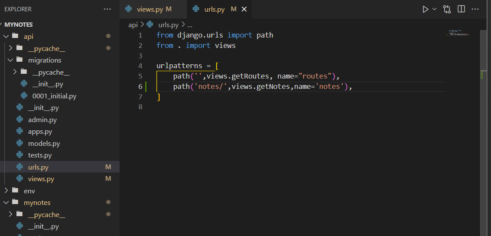

# Documentation for this project

- First create virtual enviroment
- Then install all package in the virtual enviroment

what is virtual enviroment?\
In simple term this is create a new enviroment where we install all the package we need for the project. And this project does not interact with global packages.

How to install virtual enviroment?

- pip install virtualenv
- virtualenv env      (here env is the directory name wich we want to give)\
Then we have to activate virtualenv. But how?
- env\Scripts\activate.bat         (if we use windows command prompt)
- After that it will look like that


Then install django in this virtual enviroment

<b> Keep in mind every command we execute in the (env) virtual enviroment which shown in the upper picture with red mark.</b>

Now we create django project which name is mynotes

- django-admin startproject mynotes
  


Now move the env folder to my project (mynote)

Then move to the mynote folder and run django project

- python manage.py runserver

Then create a django application in mynote folder.

### Create application

<b>Application and project is not same we crete project already. Now inside the project we create a application.</b> But How?

- python manage.py startapp applcation_name
For this project we create api application. api is application name where we manage the api.
- python manage.py startapp api

### Connect the app with project

Now we have to connect app with main project. How?

In main project (mynotes) have settings.py then open it and  there have "INSTALLED_APPS=[]"
Add my app name here. How?

- "appName.apps.appNameconfig"
For this app
- "api.apps.Apiconfig"
  
For more understanding you can explore api apps where have apps.py.

### Views and URLs

#### views

In views.py take input from the html procesesd those data and send output in HTML.

Inside the api\views.py  
Import json

- from django.http import JsonResponse


#### URLS

Urls and views are connected through urls.py

create urls.py in api folder.


Here  views.getRoutes is the function which we create in the views folder. we just connect the views.py getRotes function with urls.py

#### Connect api urls.py with project

api/views.py  <->  api/urls.py  <->  urls.py

connect api/urls.py with our main project urls.py

_

### Database

For add database (default sqlite3) execute those commend in vscmd

- python manage.py migrate

Now let's build our model(table).


After that we need to execute bolow commend for migrate our model.

- python manage.py makemigrations


After migrate the table look like that.

we learn about it more leter.

### Admin panel

For access admin first we need to create a user.

- python manage.py createsuperuser

This commend will create user for access admin panel.

- Now if want to active the model which we create then we need to register our model into the admin of app(api which we create).
- from .models import Note


Aftet that table will be created in database. In admin we can see. But if we want to edit that then we have to follow 2 commned in database section. After that we can edit that.

- python manage.py migrate
- python manage.py makemigrations

## Adding Django REST Freamework

Django REST Framework (DRF) is a widely-used, full-featured API framework designed for building RESTful APIs with Django.

- Move env folder to the "Django + React Notes App"
- Active virtual enviroment
- Install Django REST Freamework
- <https://www.django-rest-framework.org/>
  
```py
INSTALLED_APPS = [
    ...
    'rest_framework',
]
```

- Don't forget to add this line
- And move the env folder to the mynote folder

Lest use this

In the view.py of api we use this remove Jsonresponse


After that run project then see the changes.

Here api view means which operation we want to execute. like GET,SET,POST.

### Fetch data from admin database

We use REST framework for this.

Lets cheack it work or not. Build a temporary getNotes function.


Add to url.



check the output.


Yes it's work.

Let's add data to the database and query the data.


Lets query those data from database.


But here has a problem. The notes data are object. Now we can't sent object data to Response.

Now we have to serializer those data.

For serializer data we create a new file called serializers.py in api folder. Now create serializer for Note model.


Now use this serializers.py for serializer object.


1. we import the serializer
2. Then use this
3. many means many data can be serialize.(True or false)
4. serializer is model
5. Sent the data of this model we need to use .data after veriable.

Now I want to get one specific note using id.


And add to urls as always


Now see the output


# Front end - React JS

Now I will work with frontend.

First install react and start

- npx create-react-app frontend
- npm start
  
Delete some unused file. And create 2 folder

1. components
2. pages


I want to share my data through api and I updata url in Django mynote urls.py


This urls shown like bolow.


Now I write some basic code in react project which you can see in my commit throw link

- <https://github.com/MdImranHosen1/Django-React-Notes-App/tree/821e7d99c0cde8ddad9ffa3860c53863a7e41dab>
  
Now I wnat to fetch data from backend to the frontend using the url which I created.

```
http://127.0.0.1:8000/api/notes/
```

Let's see how

```js
import React, { useEffect, useState } from 'react'

const NoteListPage = () => {
    let [notes, setNotes]=useState([]);

    useEffect(() => {
      getNotes()
      
    }, [])

    let getNotes = async()=>{
        let response =await fetch('http://127.0.0.1:8000/api/notes/')
        let data =await response.json()
        console.log("data: ",data)
        setNotes(data)
    }
    return (
        <div>NoteListPage</div>
    )
}
export default NoteListPage
```

Here getNotes get data from backend. This is promise function.

- useEffect is run in 4 stage. You can learn in online.

After that we will get error. Becouse the react can't access the django api without django permission.

Now we will give permission to react using install a package
which name is django cors headers

```
https://pypi.org/project/django-cors-headers/
```

- Now cut the env folder to "Django + React Notes App"
- active the virtual enviroment
- pip install django-cors-headers
- Cut the env to mynotes folder.

Please read the upper link article.

- Now add settings.py
- Installed_apps->"corsheaders",
- MIDDLEWARE->"corsheaders.middleware.CorsMiddleware",

Now which url api we want to give access?

We can fix it. In the upper link describe the working processs.


After that in frontend->pages->NoteListPage
response link copy and create proxy in package.json


Now install react router dom
